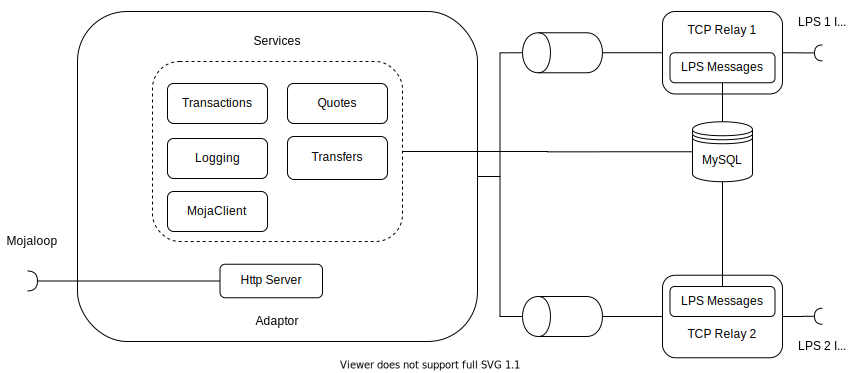

# LPS-Adapter
## NB! This project is a WIP. 

The Legacy Payments System (LPS) Adapter is a component that integrates an LPS to the Mojaloop network by providing message mapping and orchestration between the two systems. The ISO8583-87 protocol is currently supported and caters for Payee initiated payment scenarios such as ATM cash withdrawals and POS payments.

## Important considerations
- It is assumed that there is only one in-flight message coming from a particular device registered in the legacy payment system. Should another transaction initiation be received from a device whilst there is already an in-flight message, then the previous transaction will be cancelled.
- The OTP is transmitted in the clear. Work is being done to securely encrypt it whilst it is in transit.
- The LPS-Adapter hosts TCP servers in to which legacy systems can connect. Configurations where the LPS-Adapter is the client are not supported.

## Ecosystem
The LPS Adapter is setup to act as an aggregator for FSPs that are part of the LPS. i.e. The adapter is a participant in the Mojaloop system and FSPs in the Mojaloop system will settle with the adapter. The adapter operator then needs to arrange settlement with FSPs that are part of the LPS.

## Design Decisions
The ISO8583 standard has different versions (87, 93 and 2003) and each LPS may use a slightly different flavour of a specific version. In order to cater for these different cases, a logical LPS-Adapter is split into two different components viz. the TCP Relay and the Orchestrator. The former is responsible for de/encoding and field mapping and the latter for transaction state management and message orchestration. This allows for different types of the TCP Relay to be used to handle the different ISO8583 standards whilst leaving the transaction logic untouched. A redis-backed queueing service is used to persist and pass messages between the two.



### TCP Relay
This is a TCP server that accepts incoming connections from an LPS. This connection is given a manually configured LPS Id. Any messages received on this connection are decoded into JSON representation of the original message, mapped to a format that the Adapter will understand and tagged with the LPS Id. Any messages picked up off the queue are mapped to the appropriate ISO8583 message and encoded before being sent over the TCP connection. The relays have access to an LPSMessages service to store and read legacy messages from a MySQL database.

The queue setup can be found [here](./docs/queues.md).

### TCP Relay - Orchestrator message interface
These are the [messages](./src/types/adaptor-relay-messages.ts) that the adapter and tcp relay place onto and read off of the queue:
- Legacy Authorization Request
- Legacy Authorization Response
- Legacy Financial Request
- Legacy Financial Response
- Legacy Reversal Request
- Legacy Reversal Response

The TCP relay can be modified easily to accommodate different versions of the ISO8583 standard. See [here](./docs/tcp-relay.md)

### Orchestrator
This takes a queue message and maps it to an appropriate Mojaloop message which it then forwards to the Mojaloop Hub through the use of the [MojaClient](https://github.com/mojaloop/sdk-standard-components). It also hosts an HTTP server to accept Mojaloop Open API messages which it maps to a TCP Relay - Adapter message and places onto a queue for the appropriate TCP Relay to process. The Transactions, Quotes and Transfers services are used to store or read from a MySQL database.

The API surface that the orchestrator exposes can be found in the [swagger file](./src/interface/swagger.json).
The queue setup can be found [here](./docs/queues.md).

### End-to-end flow
The end-to-end message flows (from the ATM to the appropriate FSP) can be found [here](./docs/end-to-end-flow.md) for illustration purposes.

## Getting Started
This will get you a copy of the project up and running for local development.

#### Prerequisites
[Docker](https://docs.docker.com/) is required to run an instance of Redis and/or MySQL.

A MySQL docker instance can be started and a database set up with the following commands
```sh
docker run -d --name ps -e MYSQL_ROOT_PASSWORD=<password> -p 3306:3306 percona/percona-server:8.0
# wait for mysql to be ready
sleep 10

docker exec -it ps mysql -u root -proot -e "ALTER USER 'root' IDENTIFIED WITH mysql_native_password BY '<password>'"
docker exec -it ps mysql -u root -proot -e "CREATE DATABASE <db name>;"
```

Redis can be started with the following command
```sh
docker run -d -p 6379:6379 redis
```

#### Installing
Run the following to install the packages and build the project
```sh
$ npm install && npm run build
```

#### Tests
A testing database needs to be started to run the tests.
```sh
$ sh tests/setupDatabase.sh
```

Once this is done the tests can be run
```sh
$ npm run test
```

A default configuration can be started by running:
```sh
npm run start
```
This will start the adapter and one tcp relay with an `LPS_ID=lps1`. See below for other config.

#### Configuration
Some environment variables are required:

| FIELD                    | DEFAULT                             | DESCRIPTION
| ------------------------ | ----------------------------------- | ----------------------------------- |
| HTTP_PORT                | 3000                                | Port that the http server runs on to accept Mojaloop messages |
| TCP_PORT                 | 3001                                | Port that the tcp relay will listen on to accept messages from a Legacy Switch |
| ACCOUNT_LOOKUP_URL       | http://account-lookup-service.local | Endpoint to send Mojaloop party lookups |
| TRANSACTION_REQUESTS_URL | http://transaction-requests.local   | Endpoint to send Mojaloop transaction requests |
| QUOTE_REQUESTS_URL       | http://quote-requests.local         | Endpoint to send Mojaloop quote requests/responses |
| AUTHORIZATIONS_URL       | http://authorizations.local         | Endpoint to send Mojaloop authorization requests/responses |
| TRANSFERS_URL            | http://transfers.local              | Endpoint to send Mojaloop transfer requests/responses |
| ADAPTOR_FSP_ID           | adaptor                             | FSP id of the adapter  |
| QUOTE_EXPIRATION_WINDOW (seconds) | 10000                      | Time in seconds the quote is valid for |
| ILP_SECRET               | secret                              | Secret to use when creating ILP conditions |
| KNEX_CLIENT              | sqlite3                             | The database client. Options: sqlite3 or mysql |
| MYSQL_HOST (optional)    | -                                   | Host of the MySQL database |
| MYSQL_USER (optional)    | -                                   | User for the MySQL database |
| MYSQL_PASSWORD (optional)| -                                   | Password for the MySQL database |
| MYSQL_DATABASE (optional)| -                                   | Database target in the MySQL database |

### Deployment
Coming soon.

### License
This project is licensed under the Apache License, Version 2.0. See the [license](./LICENSE.md) file for more details.