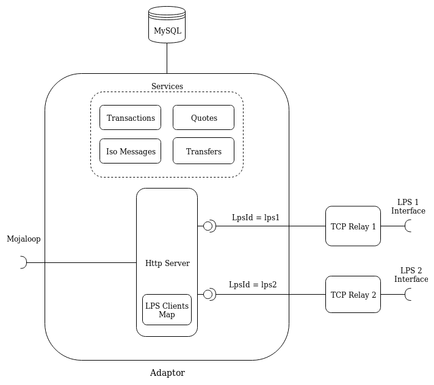

WIP: Adaptor that accepts messages from legacy payment systems (ISO8583) over TCP and converts it to Mojaloop Open API requests.

## Architecture

### TCP Relay
This is a TCP server that accepts incoming connections from a Legacy Payment System. This connection is given a manually configured LPS Id. Any messages received on this connection are decoded into JSON representation of the original message and tagged with the LPS Id. It then routes this to the appropriate endpoint on the Adaptor according to the MTI.

### Adaptor
This is an HTTP server that exposes endpoints that accept a JSON representation of ISO8583 messages. It then maps this to appropriate Mojaloop messages and forwards them to the Mojaloop Hub. It also accepts Mojaloop Open API messages which it maps to ISO8583 messages and forwards it to the legacy payment system. The Transactions, Quotes, IsoMessages and Transfers services are used to store the messages in to a MySQL database.

The API surface that the adaptor exposes can be found in the [swagger file](./src/interface/swagger.json).

### DB Schema

### Configuration
Some environment variables are required:
| FIELD                    | DEFAULT                           |
| ------------------------ | --------------------------------- |
| HTTP_PORT                | 3000                              |
| TCP_PORT                 | 3001                              |
| ML_API_ADAPTOR_URL       | http://ml-api-adaptor.local       |
| TRANSACTION_REQUESTS_URL | http://transaction-requests.local |
| QUOTE_REQUESTS_URL       | http://quote-requests.local       |
| KNEX_CLIENT              | sqlite3                           |

### Flow
The full end-to-end flow is described below for an ATM cash-out scenario.

