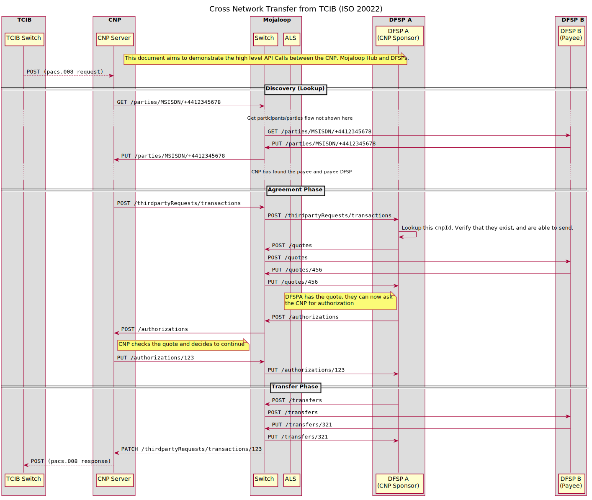

## Cross Network ISO20022 Flow

The flow demonstrates a payment initiated in the TCIB system where the payee institution (as identified in TCIB) is a cross network provider that is also a participant in the Mojaloop system.

Upon a receiving a payment instruction the CNP uses the third-party APIs to initiate a transfer from its own account at a participant DFSP to the account of the payee.

