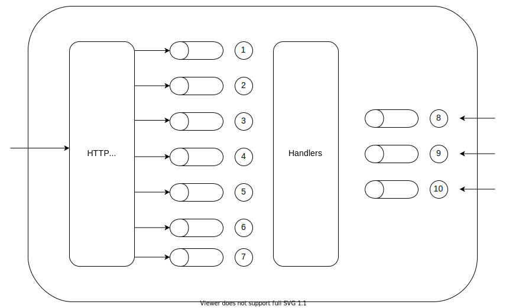
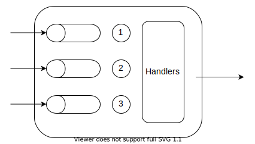

# Queues

[BullMQ](https://github.com/taskforcesh/bullmq) is Redis backed queue and scheduling library. It used to set up the queues and workers used to pass messages between the relays and orchestrator. The architecture is to have a queue per message type and is explained further below.

The orchestrator has an http server which accepts Mojaloop messages and puts it onto the following queues:
1. Transaction Request Responses
2. Party Lookup Responses
3. Quote Requests
4. Quote Responses
5. Authorization Requests
6. Transfer Requests
7. Transfer Responses

It also has queues to receive messages from the TCP relays:
8. Legacy Authorization Requests
9. Legacy Financial Requests
10. Legacy Reversal Requests

Each TCP relay will have the following queues to accept messages from the adapter:
1. <LPS ID>Authorization Responses
2. <LPS ID>Financial Responses
3. <LPS ID>Reversal Responses
Note that the queues are prefixed with the manually configured `LPS ID`.
